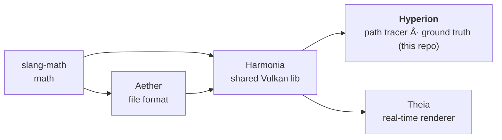

# AGENTS.md — Hyperion

Quick-start context for AI agents so basic facts don't have to be rediscovered each session.

**Outstanding work, governance (definition of done + guardrails) and release history: see
[`PLAN.md`](PLAN.md).**

## What this repo is

**Hyperion** is a Vulkan **path tracer** and the **ground-truth reference renderer** for the
pipeline. It uses ray tracing (BLAS/TLAS), index buffers, NEE + MIS with environment
importance sampling (CDF). Other renderers (Theia) are aligned to match Hyperion.

**Material model = OpenPBR Surface** (Academy Software Foundation), whose canonical/reference
implementation is **MaterialX** (`mx_*` genGLSL nodes). Hyperion's BSDF (the shared Harmonia
`bsdf_shared.slang`) is the **conformance ground truth** for OpenPBR in this pipeline; when
improving spec-correctness, fix it here first, regenerate references, then align Theia. It
implements the full OpenPBR 1.1.1 layer stack — LTC sheen, GGX multiple-scattering compensation,
thin-film iridescence, dispersion, and a **chromatic volumetric subsurface / transmission random
walk** (per-channel extinction, hero-wavelength spectral MIS). The dielectric interface is
**side-correct** (`SurfaceHit.backface` → `exiting` → inverted relative IOR: Fresnel/Snell/TIR
on exit; `geometry_thin_walled` exempt — a thin film has no bulk, so its crossings never TIR).
Transmission absorption follows **MaterialX tint semantics** (BTDF tinted by `transmission_color`
at depth 0, white at depth > 0 with the color realized volumetrically by the walk,
σ_t = −ln(color)/depth); pure absorbers (single-scatter albedo = 0) use **exact deterministic
Beer–Lambert transmittance** at the boundary (ratio-tracking degenerate case — zero walk
variance). Theia mirrors the same shared walk in its RT-GI compute path; Hyperion remains the
ground truth where the full offline light transport (dispersion, multi-bounce glass, unbounded
walks) is exact — still cross-check parameters/behaviour against MaterialX.

Pipeline (dependency direction):



Consumes Aether + Harmonia via CMake FetchContent. The demo is a thin `harmonia::App`
subclass injecting `harmonia::IRenderer`.

## Running

```powershell
build/hyperion.exe --scene cornell_classic --output out.exr            # headless EXR+PNG
build/hyperion.exe --scene dragon_teapot --spp 256 --output ref.exr    # clean IBL reference
build/hyperion.exe shaderball_base                                     # interactive window
```

CLI flags: all common Harmonia flags (`--scene/-s`, `--output/-o`, `--width`, `--height`,
`--validation`/`--no-validation`) **plus** Hyperion-only:

| Flag | Default | Meaning |
|------|---------|---------|
| `--spp <n>` | scene preset value | Override samples per pixel |
| `--depth <n>` | scene preset value | Override max bounce depth |

⚠️ No `--offscreen` flag — headless is triggered by `--output`.

## Gotchas (these waste a cycle every time they're forgotten)

- **Assets come from `build/_deps/aether-src/assets/`** (FetchContent clone), NOT the working
  Aether tree. Editing the Aether working tree's `assets/` does nothing unless you also
  update the `_deps` copy or build with `-DFETCHCONTENT_SOURCE_DIR_AETHER=...`. Symptom:
  two "different" renders give byte-identical metrics. See Aether/AGENTS.md.
- **spp for parity:** the meadow IBL scenes reference 64–128 spp presets (noisy under IBL).
  Pass `--spp 256` when producing a parity reference, or the diff measures Monte-Carlo
  noise, not a real discrepancy.
- **Emissive winding:** emissive-triangle normals derive from OBJ winding
  (`cross(edge1,edge2)`); back-facing emitters are skipped in NEE. OBJs must be
  outward-facing (CCW-from-outside) or they render black.

## Test scenes

- Quick parity/iteration (cheap): `cornell_classic`, `cornell_spheres`, `cornell_suzanne`,
  `dragon_teapot`.
- **Never** use `ABeautifulGame` for quick test renders — it is expensive.
  (It is required only in final screenshot/render *deliverable* batches, not iteration.)

## Build & test

```powershell
cmake -S . -B build -G Ninja -DCMAKE_BUILD_TYPE=Release `
      -DCMAKE_C_COMPILER=clang-cl -DCMAKE_CXX_COMPILER=clang-cl `
      -DCMAKE_TOOLCHAIN_FILE="<vcpkg-root>/scripts/buildsystems/vcpkg.cmake"
cmake --build build
cd build; ctest --output-on-failure
```

Equivalent preset flow (Ninja + Release + clang-cl + `$env:VCPKG_ROOT` toolchain):
`cmake --preset win` / `cmake --build --preset win` / `ctest --preset win`.

> **⚠️ Do not run things in parallel — it slows the machine to a crawl.**
> - **Tests are serialised in CMake:** every test carries `RUN_SERIAL`, so `ctest -j`
>   cannot parallelise them. That only covers *within* one `ctest` invocation, so still
>   run ONE repo's suite at a time (never Harmonia + Theia + Hyperion together).
> - **GPU jobs strictly one after the other:** renders, gallery generation and parity
>   gates all saturate the GPU. Run one, wait for it to finish, then start the next.
>   Two concurrent jobs make both several times slower and interleave their logs.
> - **Offscreen capture self-deprioritises:** `App::renderOffscreen()` drops the
>   process to below-normal CPU priority (`BELOW_NORMAL_PRIORITY_CLASS` on Windows,
>   nice +10 on POSIX) for the whole capture, so the desktop stays usable while a
>   render runs. A per-frame `std::this_thread::yield()` alone is NOT sufficient - it
>   is `SwitchToThread()`/`sched_yield()`, only a hint that does nothing when no
>   equal-or-higher-priority thread is already runnable. On POSIX the drop is one-way
>   for an unprivileged process (raising priority back needs `CAP_SYS_NICE`), so it is
>   used only in the one-shot capture path. This helps *during* a capture; it is still
>   not licence to run two captures at once.

**Static analysis:** `python tools/check_tidy.py` — parallel clang-tidy over
`build/compile_commands.json`, classified per `.clang-tidy`'s WarningsAsErrors contract
(clang-diagnostic/clang-analyzer/bugprone fail the run; modernize/performance/portability
are report-only). Also registered as ctest `test_tidy` (label `analysis`; the fast test loop is `ctest -LE analysis`; skips when
clang-tidy, Python3 or the database is missing). Sanitizer lane (Clang/GCC configures only):
`-DHYPERION_SANITIZER=address|undefined|thread`. Host-side FP is deterministic
(`/fp:strict` / `-ffp-contract=off -fno-fast-math`).

SDL3, slangc and volk come from the Vulkan SDK (not vcpkg). vcpkg provides tomlplusplus and OpenImageIO.

## Conventions

- Commit, but do **not** push unless asked.
- **GPU-driven, latest standard Vulkan, cross-vendor only** (core + `KHR`/`EXT`). No
  vendor-specific extensions (`VK_NV_*`/`VK_AMD_*`/`VK_INTEL_*`) — must run on any vendor.
- Working color space is scene-referred (e.g. `lin_rec2020_scene`).

## GPU-driven design (Hyperion)

**Principle:** GPU-driven by design — all dispatch parameters are GPU-resident and pre-set;
`render()` is a pure GPU command record with no CPU→GPU data transfer on the hot path.

**Indirect RT dispatch (`VK_KHR_ray_tracing_maintenance1`, required):**
- `ray_tracing_maintenance1` is a **hard-required** device feature — Harmonia's device
  selection (`Context.cpp`) fails fast when it is absent. Hyperion dispatches rays exclusively
  through `vkCmdTraceRaysIndirect2KHR`. The `VkTraceRaysIndirectCommand2KHR` buffer (SBT
  addresses + render dimensions) is written **once** at `PathTracer::create()` and updated in
  `onResize()`. The per-frame `render()` path records only GPU commands — no host writes.

**Acceleration structure builds — device-side only (Khronos deprecation compliant):**
- All BLAS builds: `vkCmdBuildAccelerationStructuresKHR` (Harmonia `Geometry::buildBlas`).
- All TLAS builds: `vkCmdBuildAccelerationStructuresKHR` (`SceneBase::buildTlas`).
- `vkBuildAccelerationStructuresKHR` (host-side) is **never used** — deprecated per the
  [Khronos RT AS deprecation blog](https://www.khronos.org/blog/vulkan-ray-tracing-deprecating-host-side-acceleration-structure-builds).
- `VK_KHR_device_address_commands` / `vkCreateAccelerationStructure2KHR` is the future
  forward path — now available on the dev GPU (RTX 5070, driver 616.92); adoption tracked as MOD5 (Harmonia/PLAN.md).
