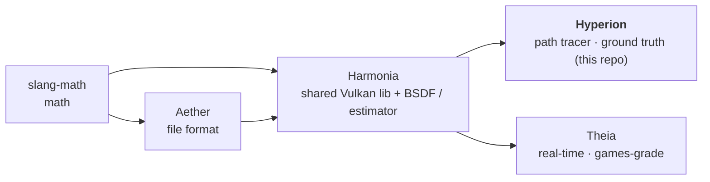

# PLAN — Hyperion

**Living source of truth for outstanding work.** Shipped items are removed from the work
lists; the shipped record is the *Baseline* below and `git log`. Only outstanding work is
tracked here.

**How to read this plan** — *human / PM:* *How to continue* is the prioritized next-up list.
*AI agent picking up work:* read `AGENTS.md` (orientation, gotchas) → *How to continue*
(your task) → *Governance* (definition of done + guardrails) **before editing**.

## Context

Hyperion is the **offline path tracer and unbiased ground truth** of a five-repo rendering
pipeline:

The family goal: improve both renderers with the latest algorithms from the industry
(SIGGRAPH 2025–26 and surrounding literature), adopting each technique in the **shared
Harmonia estimator + BSDF** wherever both renderers benefit; per-renderer only where they
genuinely diverge. **Theia converges to Hyperion** — Hyperion is the reference the parity
gate measures against. Most estimator work is therefore owned by Harmonia (see
`Harmonia/PLAN.md`); this file tracks what Hyperion owns or consumes. Sibling plans:
`Harmonia/PLAN.md`, `Theia/PLAN.md`, `Aether/PLAN.md`, `slang-math/PLAN.md`.

## At a glance

- **Release:** v0.7.8 — lockstep with Harmonia/Theia (slang-math v0.2.1, Aether v0.7.4;
  all tag-synced with GitHub).
- **Last shipped (v0.7.7):** C14/VK2 — real OpenPBR `geometry_opacity` cutout; Hyperion's
  slice was the shadow-only any-hit hit-group pair (see Baseline). **v0.7.8** is a
  conformance/tooling wave (see Baseline).
- **Next:** nothing Hyperion-owned is on the family's next-up list right now — the active
  items (GI-SMS, C9, DN3, LS2, PERF5/PERF4, C11, C12) land in the **shared estimator**
  (Harmonia/PLAN.md) and are consumed here. Hyperion-owned backlog: PERF3, PERF6, ANI7.

## How to continue

### Owned items

| ID | Task | Deps | Status |
|----|------|------|--------|
| PERF3 | **GPU acceleration-structure pipeline** for Hyperion (reframe — CPU-side BV is stale under hwRT): AS **refit-vs-rebuild + compaction** (Vulkan 1.4 `vkCmdBuildAccelerationStructures`). Prerequisite for ANI2 (per-frame refit). `VK_EXT_opacity_micromap` itself shipped standalone in v0.7.7 — that was the single-mesh cutout-acceleration use case only; this item is the broader refit/rebuild/compaction pipeline, unaffected. | — | backlog |
| PERF6 | **RAFI** multi-node/multi-GPU ray forwarding (Wald, Zellmann et al. — 2026, [arXiv:2605.30294](https://arxiv.org/abs/2605.30294)); Hyperion large-scene/streaming scaling. | — | backlog |
| ANI7 | **Render animated sequence to disk** — batch/offline render of a timeline range: for each frame, sample the node graph at shutter time, render (Hyperion path trace / Theia accumulate via `--offscreen-frames`) and write per-frame EXR+PNG to disk. The animation production output step — the sequence equivalent of headless `--output`. | ANI1, ANI2 | backlog |
| SM6-Hyperion | **slang-math v0.3.0 migration slice** — test-mirror `rsqrt`/`saturate` cleanup (`tests/unit/test_bsdf.cpp:491` hand-mirrored `1/std::sqrt`); bump the FetchContent pin in this repo's release commit. Track origin: slang-math/PLAN.md SM6. | slang-math v0.3.0 tag | backlog |

### Consumed items (owned elsewhere — pointers)

These change the shared estimator/BSDF in Harmonia; Hyperion consumes them 1:1 and must keep
its ground-truth properties (deterministic replay, no bias) intact:

- **GI-SMS** (caustics/SDS), **C9** (bounded VNDF), **C11** (ReSTIR SSS), **C12** (micrograin
  flake), **DN3** (converging denoiser), **LS2** (neural product IS — **replaces Hyperion's
  env-CDF/NEE** in the shared estimator; the old env-CDF path is deleted), **PERF5/PERF4**
  (wavefront scheduling + ray reordering) — all owned by `Harmonia/PLAN.md`.
- **ANI2** (per-frame TLAS refit machinery, Harmonia; needs PERF3 here), **ANI6** (animated
  parity gate, Harmonia; needs PAR3 + ANI7), **BV4** (wavefront ray-gen/NEE AABB consumers,
  Harmonia; gated by PERF5).
- **NH2/NH3** (node-graph transform compounding, Harmonia) once **NH1** (Aether) lands.
- **I6** (frames-per-flip) is Theia-only (`Theia/PLAN.md`).

## Governance

**Definition of done (per change):** `ctest` green **+** a representative headless render
validation-clean **+** warning-clean build (clang-cl `/W4 /WX /permissive- /Zc:__cplusplus`,
Clang/GNU `-Wall -Wextra -Werror -Wpedantic`; a compiler warning is a build failure — fix the
cause, never silence it; a Vulkan validation message is a bug, never noise). **Per release:**
the above plus `verify-full` (verify + format-check + clang-tidy + cppcheck) **plus** the
parity harness (`Harmonia/tools/render_and_validate.py` over `validation_manifest.toml`)
**plus** `Harmonia/tools/check_vulkan_validation.py` over the full 30-scene gallery **plus**
regenerated screenshots.

**Screenshot standard:** gallery PNGs 1280×720 at **64 spp** (fireflies acceptable — 256 spp
is too slow for the full set); **parity references** are distinct: a clean Hyperion
**256 spp** EXR at the 320×240 parity resolution (never compare against a low-spp reference —
the low-spp trap, Aether/AGENTS.md).

**Guardrails:**

- **Hyperion is unbiased — no clamps/hacks in the estimator.** The render-path firefly clamp
  is removed; do not reintroduce one. Carve-out: a neighbourhood soft-clamp exists in the
  **display path only** (`Harmonia/shaders/tonemap.slang`) and never touches the
  scene-referred EXR that parity is measured on.
- **Deterministic replay:** `--deterministic-replay` EXR output must stay bit-identical
  across estimator/scheduling changes (this is the gate for the wavefront redesign, PERF5 in
  Harmonia/PLAN.md — preserve the exact RNG sequence).
- **The denoiser is a presentation stage, never part of the estimator:** forced off for
  `--output` (the capture is the raw scene-referred estimator result). Do not re-enable it on
  the capture path, and do not describe it as converging.
- Shared-BSDF contracts owned by Harmonia apply here verbatim (see `Harmonia/PLAN.md`
  guardrails): dielectric sidedness (raw outward `geoNormal`), the Chiang 2019 terminator
  factor at every NEE/continuation site, object-space position-fetch vertices (transform by
  `ObjectToWorld3x4`), MaterialX transmission-tint semantics, exact Beer–Lambert for pure
  absorbers, device-only AS builds.
- **Vulkan policy: latest + KHR/EXT, modern over legacy, no fallbacks.** Target the latest
  stable Vulkan (1.4); core + KHR/EXT over vendor extensions; no fallback paths — an optional
  capability is permitted only when its absent-branch is image-identical and free (the
  probe→enable pattern, `Harmonia/PLAN.md` §Vulkan capability adoption).
- Fix bugs at once — root-caused and patched in the same session. Solve directly, never defer.
- Tags are always pushed to GitHub (verify `git ls-remote --tags origin` == `git tag -l`).
  Release order: slang-math → Aether → Harmonia → **Hyperion**; bump the Harmonia
  FetchContent pin in the release commit.
- Commit per-repo; push only on explicit OK.
- Living document — done work is removed from this file; the record is the Baseline and
  `git log`.

## Baseline

- **v0.7.8** (current): consumes Harmonia v0.7.8 (VK11 `shaderDemoteToHelperInvocation`;
  OpenPBR 1.1.1 conformance: `specular_weight` > 1 with the spec's ξ_s·F_s ≤ 1 clamp, and the
  transmission negative-μ_a gray-shift) and Aether v0.7.4 (spec defaults: coat_ior 1.6,
  thin_film_ior 1.4, thin_film_thickness 500 nm). New conformance test
  `Bsdf.SpecularWeightAboveOneBoostsDielectricF0WithinSpecClamp` (the >1 boost is real; an
  extreme weight stays furnace-bounded) + the test-side `openpbrModulatedEta` mirror synced.
  Tooling (presets / check_tidy.py + test_tidy / HYPERION_SANITIZER / deterministic FP).
  43 ctest green.
- **v0.7.7**: **C14/VK2 — real OpenPBR `geometry_opacity` cutout.** A shadow-only
  any-hit hit-group pair (`anyhit.slang`, `triangleShadowAnyHit`/`sphereShadowAnyHit`)
  accumulates the ∏(1-α) transmittance product and ends the search early on a fully-present
  hit; the radiance hit groups carry no any-hit (camera/indirect opacity stays the estimator's
  stochastic gate). SBT/pipeline widened from 2 to 4 hit-group records
  (`Pipeline::kHitGroupCount`); sphere instances moved to record offset 2. 42 ctest green;
  `shaderball_checker` verified PASS (with-extension vs without-extension image-identical).
- **v0.7.6**: consumed Harmonia's Vulkan capability adoption (VK6/VK8/VK10) live; no
  Hyperion-specific changes.
- **v0.7.5**: **B4** (emissive analytic-sphere NEE — uniform-cone sampling with the
  light-selection pdf folded in; non-uniform-scaled ellipsoids skipped; + test scene & unit
  tests), **B5** (`--no-postfx` made real; unknown CLI args hard-error), **FB1** (the
  `traceRaysIndirect2`→`traceRays` fallback removed — `ray_tracing_maintenance1` is now a hard
  requirement). 142 ctest across the family; validation 58/58 clean.
- **v0.7.4**: two-tier denoiser output contract consumed (A-SVGF forced off for `--output`).
- **v0.7.3**: code-health refactoring (R6 RAII handles, R12 namespaces); 29-scene gallery
  regenerated. No rendering behavior change.
- **v0.7.2**: Extract Function pass (`PathTracer::render` 155L and others); no behavior change.
- **v0.7.1**: bug fixes B1 (emission gate on winding side via `SV_IsFrontFace`), B2
  (`round()`→`floor()` reprojection).
- **Earlier (v0.6.19 → v0.7.0):** OpenPBR conformance **C0–C7** — the full
  `bsdf_shared.slang` ↔ MaterialX audit is closed; Hyperion's BSDF *is* the conformance
  ground truth. Point-by-point detail in `git log`.
